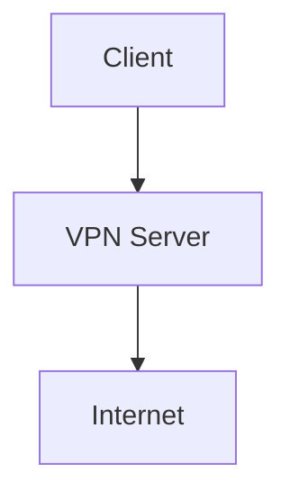
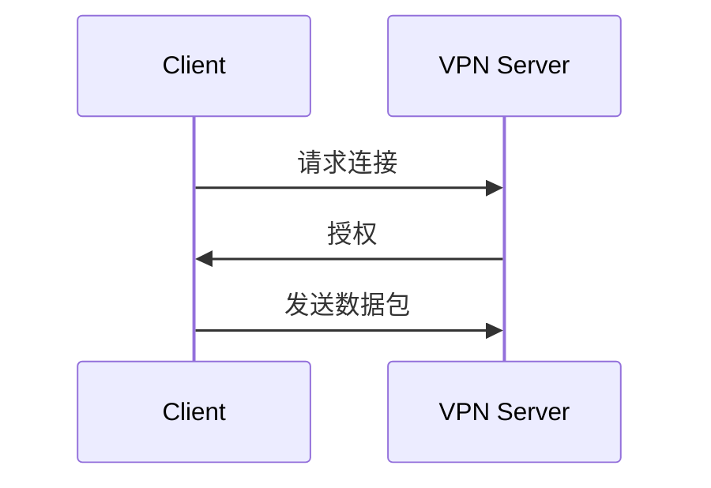

# 轻量级私有TCP隧道VPN（Windows客户端）

## 阶段1网络架构设计

### 拓扑

### IP计划
- 网络：10.8.0.0/24
- 地址池和IPAM租约规则

### 设备ID
使用客户端证书的SHA-256指纹

### 设备绑定规则

### 连接建立序列图

### 数据平面管理约束

### 日志/警报接口事件及字段

### 阶段1接受标准
- 인증通过后分配IP
- 分配后启用数据面
- 心跳5s/超时60s
- 静态冲突拒绝新连接
